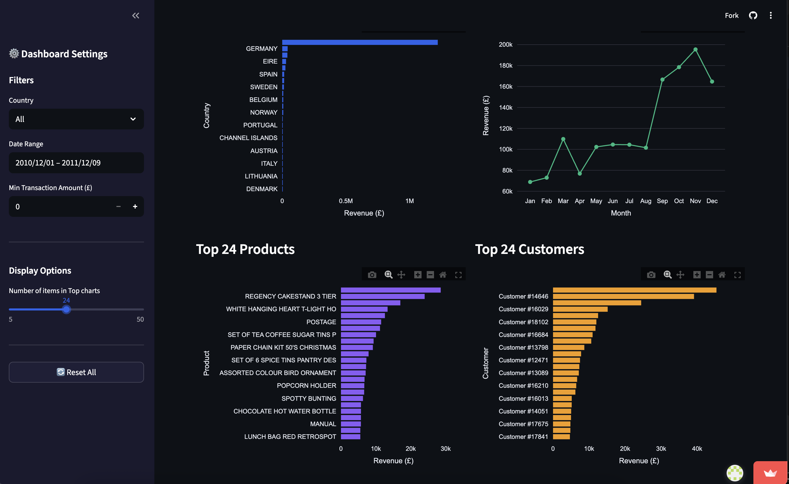
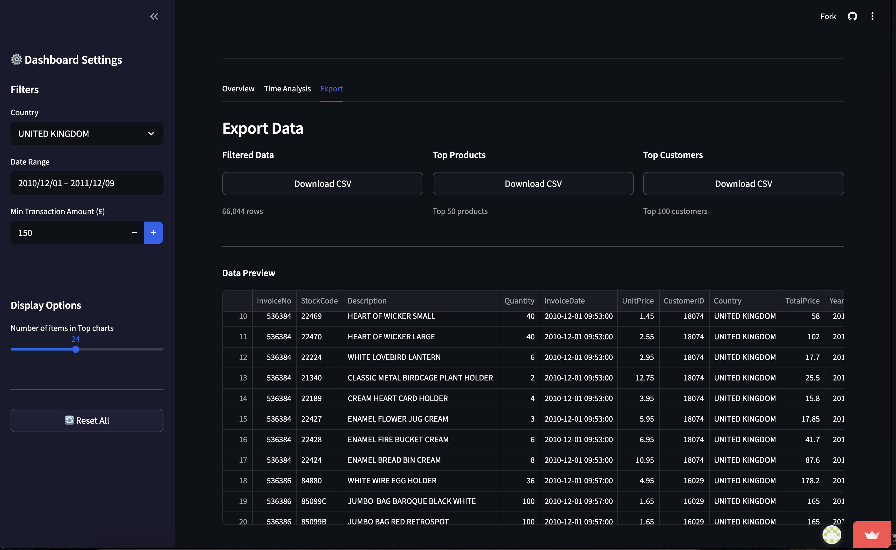

# E-commerce Analytics Dashboard

[](https://4obfdhcbx64kebwc6cnt3v.streamlit.app/)
[](https://www.python.org/)

## 📝 Description

Ce projet consiste en la création d'un **tableau de bord interactif** pour analyser les données de ventes d'une entreprise e-commerce basée au Royaume-Uni.
Réalisé en Python avec **Streamlit** et **Plotly**, il permet de visualiser les indicateurs clés de performance (KPIs), d'explorer les tendances temporelles et d'identifier les meilleurs clients et produits.
L'objectif est de transformer des données brutes transactionnelles en insights actionnables pour la prise de décision.

## 🎯 Objectifs

L'objectif principal est de fournir une interface intuitive pour :
*   **Suivre la performance globale** : Chiffre d'affaires, volume de ventes, panier moyen.
*   **Comprendre la clientèle** : Segmentation géographique et analyse des meilleurs clients.
*   **Analyser les produits** : Identification des best-sellers.
*   **Détecter les tendances** : Saisonnalité mensuelle, jours et heures de pointe.

## 💾 Source du Dataset

Les données proviennent de l'**Online Retail Dataset** (UCI Machine Learning Repository / Kaggle).
*   **Période** : 01/12/2010 au 09/12/2011 (1 an)
*   **Volume** : ~540 000 transactions
*   **Contenu** : N° Facture, Code Produit, Description, Quantité, Date, Prix Unitaire, ID Client, Pays.

_Source originale : [Kaggle - Online Retail Dataset](https://www.kaggle.com/datasets/ulrikthygepedersen/online-retail-dataset)_

## 🛠 Technologies Utilisées

*   **Langage** : Python 3.11
*   **Interface Web** : Streamlit
*   **Manipulation de données** : Pandas, NumPy
*   **Visualisation** : Plotly Express (interactif), Seaborn/Matplotlib (statique)
*   **Gestion de version** : Git / GitHub

## ⚙️ Installation

Pour exécuter ce projet localement, suivez ces étapes :

1.  **Cloner le dépôt :**
    ```bash
    git clone https://github.com/Sam050803/ecommerce-dashboard.git
    cd ecommerce-dashboard
    ```

2.  **Créer un environnement virtuel (recommandé) :**
    ```bash
    python -m venv venv
    source venv/bin/activate  # Sur macOS/Linux
    # venv\Scripts\activate   # Sur Windows
    ```

3.  **Installer les dépendances :**
    ```bash
    pip install -r requirements.txt
    ```

## 🚀 Utilisation

1.  **Lancer l'application Streamlit :**
    ```bash
    streamlit run app.py
    ```

2.  **Accéder au dashboard :**
    Le navigateur s'ouvrira automatiquement à l'adresse `http://localhost:8501`.

3.  **Fonctionnalités :**
    *   Utilisez la barre latérale pour filtrer par **Pays**, **Date**, ou **Montant Minimum**.
    *   Naviguez entre les onglets **Overview**, **Time Analysis**, et **Export**.
    *   Téléchargez les données filtrées ou les tableaux récapitulatifs en CSV.

## 🖼️ Aperçu du Dashboard

### 1. Vue d'ensemble (Overview)
*Indicateurs de performance globaux (KPIs).*


*Détail des meilleurs produits et clients (Top Charts).*



### 2. Analyse Temporelle
*Évolution du chiffre d'affaires (Mensuel, Hebdomadaire, Horaire).*


### 3. Export de Données
*Filtrage dynamique et téléchargement des résultats.*



## 💡 Insights Clés

Quelques découvertes issues de l'analyse des données :
*   **Chiffre d'affaires total** : ~10.7 Millions £ sur la période.
*   **Saisonnalité** : Un pic de ventes très marqué est visible en **Novembre 2011**, probablement dû aux achats de fin d'année.
*   **Marché principal** : Le **Royaume-Uni** représente la grande majorité du chiffre d'affaires.
*   **Produits** : Les articles de décoration "vintage" et les sacs sont parmi les plus populaires.
*   **Meilleurs Clients** : Une petite fraction des clients génère une part significative du revenu (principe de Pareto).
*   **Horaires** : Les commandes sont plus fréquentes en milieu de journée (10h-15h) et nulles le samedi (fermeture probable).

## � Documentation Détaillée

Pour aller plus loin dans la compréhension technique du projet, consultez ces rapports détaillés :

*   **[🧹 Rapport de Nettoyage (CLEANING.md)](CLEANING.md)** : Détail des étapes de préparation des données (valeurs manquantes, doublons, filtrage, conversion de types).
*   **[📊 Rapport d'Analyses (ANALYSES.md)](ANALYSES.md)** : Analyses approfondies, questions métier résolues et méthodologie utilisée pour extraire les insights.

## �📂 Structure du Projet

```text
ecommerce-dashboard/
├── app.py                  # Application principale Streamlit
├── requirements.txt        # Liste des dépendances Python
├── README.md               # Documentation du projet
├── .gitignore              # Fichiers ignorés par Git
├── src/
│   ├── preprocessing.py    # Script de nettoyage des données
│   ├── analysis.py         # Fonctions de calcul des KPIs
│   └── visualization.py    # Fonctions de génération des graphiques
├── data/
│   ├── raw/                # Données brutes (ignoré par Git)
│   └── processed/          # Données nettoyées et échantillonnée
├── images/                 # Captures d'écran et graphiques exportés
└── notebooks/              # Notebooks Jupyter pour l'exploration
```

## 🧠 Compétences Techniques & Méthodologiques

*   **Développement Python Avancé** : Architecture modulaire (dossier `src/`), respect des bonnes pratiques (PEP 8, docstrings), et typage des données.
*   **Traitement de Données (ETL)** : Pipelines de nettoyage et de transformation robustes avec **Pandas** (gestion des valeurs nulles, formatage des dates, filtrage complexe).
*   **Data Visualisation Interactive** : Conception de graphiques dynamiques et réactifs avec **Plotly Express** pour maximiser l'expérience utilisateur.
*   **Développement Web Data** : Maîtrise du framework **Streamlit** (gestion du `Session State`, mise en cache `@st.cache_data`, layout responsive).
*   **Analyse Stratégique** : Capacité à traduire des besoins métier en indicateurs techniques (KPIs) et dashboards de pilotage.
*   **DevOps & Versioning** : Gestion de projet sous **Git/GitHub**, utilisation d'environnements virtuels (`venv`) et déploiement continu sur le Cloud.

## 🚀 Améliorations Possibles

*   Ajouter une **analyse prédictive** (Forecasting) du chiffre d'affaires futur.
*   Implémenter une **segmentation client RFM** (Récence, Fréquence, Montant) avancée.
*   Ajouter un système d'authentification pour sécuriser l'accès au dashboard.
*   Optimiser le chargement des données pour de très gros volumes (ex: utiliser Parquet au lieu de CSV).

## 👤 Auteur

**Seyyid-Aassuf**
*   *Développeur Data & IA*
*   [GitHub](https://github.com/Sam050803)
*   [LinkedIn](https://www.linkedin.com/in/seyyid-aassuf-mamadou-96bb27374)

---
*Dernière mise à jour : 21 Janvier 2026*
