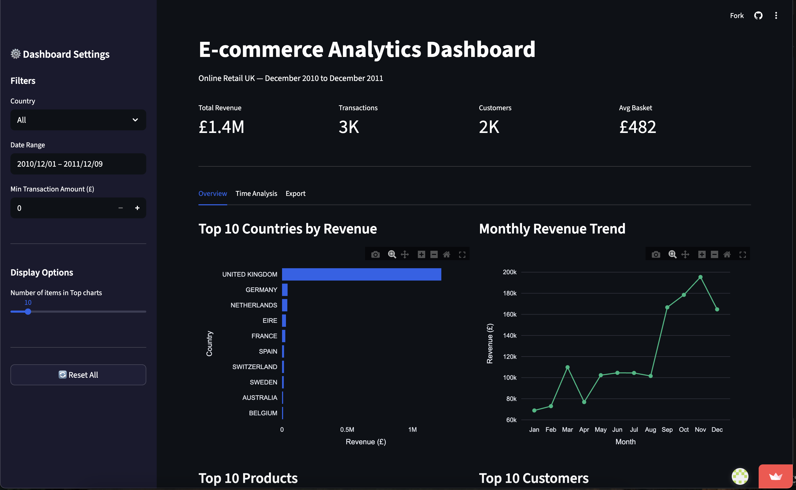
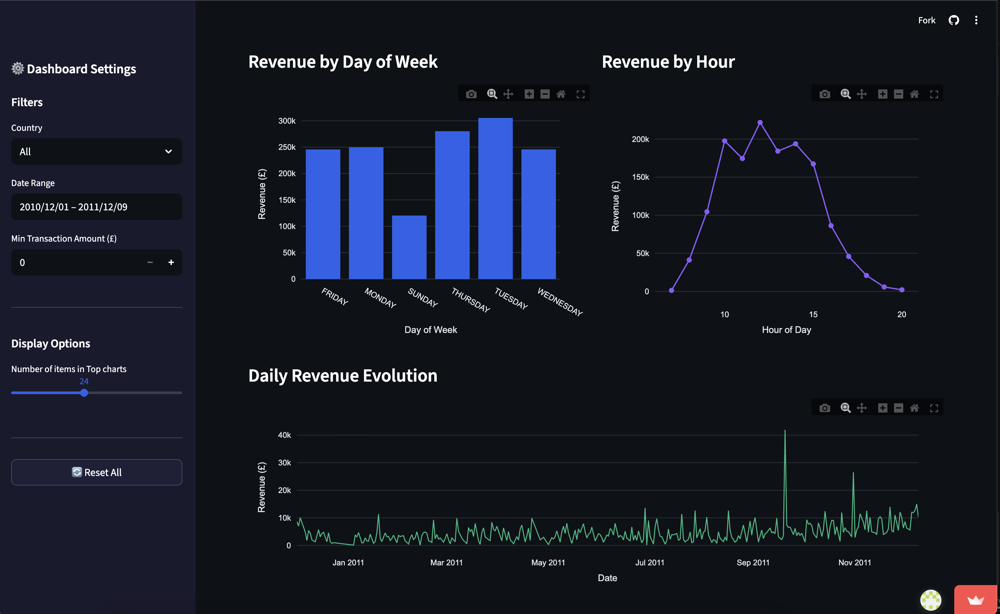

# E-commerce Analytics Dashboard

[](https://4obfdhcbx64kebwc6cnt3v.streamlit.app/)
[](https://www.python.org/)

## � Description

Ce projet consiste en la création d'un **tableau de bord interactif** pour analyser les données de ventes d'une entreprise e-commerce basée au Royaume-Uni.
Réalisé en Python avec **Streamlit** et **Plotly**, il permet de visualiser les indicateurs clés de performance (KPIs), d'explorer les tendances temporelles et d'identifier les meilleurs clients et produits.
L'objectif est de transformer des données brutes transactionnelles en insights actionnables pour la prise de décision.

## � Objectifs

L'objectif principal est de fournir une interface intuitive pour :
*   **Suivre la performance globale** : Chiffre d'affaires, volume de ventes, panier moyen.
*   **Comprendre la clientèle** : Segmentation géographique et analyse des meilleurs clients.
*   **Analyser les produits** : Identification des best-sellers.
*   **Détecter les tendance** : Saisonnalité mensuelle, jours et heures de pointe.

## 💾 Source du Dataset

Les données proviennent de l'**Online Retail Dataset** (UCI Machine Learning ReLes données proviennent de l'**Online Retail Dataset** (UCI Machine Learning ReLes données proviennent de l'**Online Retail Dataset** (UCI Machine Learninescription, Quantité, Date, Prix Unitaire, ID Client, Pays.

_Source originale : [Kaggle - Online Retail Dataset](https://www.kaggle.com/datasets/ulrikthygepedersen/online-retail-dataset)_

## 🛠 Technologies Ut## 🛠 Technologies Ut## 🛠 Technologies Ut## 🛠 Technologies Ut## 🛠 Technologies Ut## 🛠 Technologies Ut## ğmPy## 🛠 Techlisation** : Plotly Express (interactif), Seaborn/Matplotlib (statique)
*   **Gestion de version** : Git / GitHub

## ⚙� Installation

Pour exécuter ce projet localement, suivez ces étapes :

1.  **Cloner le dépôt :**
    ```bash
    git clone https://github.com/Sam050803/ecommerce-dashboard.git
    cd ecommerce-dashboard
    ```

2.  **Créer un environnement virtuel (recommandé) :**
    ```bash
            m venv venv
    sou    sou    sou    sou    sou    sou    sou    sou    sou    sou    sou    sou    sou    sou    sou    sou    sou    sou    sou    sou    sou    sou    sou    sou    sou    sou    sou    sou    sou    sou    sou    sou    sou    sou    sou    sou    sou    sou    sou    sou    sou    sou    sou 
2.2.2.2.2.2.2.2.2.2.2.2.2.2.2.2.2.2.2.2.2.2.2.2.2.2.2.2.2.2.2.2.2.2.2.2.2.2.2.2.2.2.2.2.2.2.2.2.2.2.2.2.2.2.2.2.2.2.2.2.2.2.2.ionna2.2.2.2.2.2.2.2.2.2.2.2.2.2.2.2.2.2.2.2.2.2.2.2.2.2.2.2.2.2.2.2.2.2.2.2.2.2.2.2.2.2.2.2.2.2.2.2.2.2.2.2.2.2.2.2.2.2.2.2.2.2.2.ionna2.2.2.2.2.2.2.2.2.2.2.2.2.2.2.2.2.2.2.2.2.2.2.2.2.2.2.2.2.2.2.2.2.2.2.2.2.2.2.2.2.2.2.2.2.2.2.2.iltrées ou les tableaux récapitulatifs en CSV.

## 🖼� Aperçu du Dashboard

### Vue d'ensemble (Overview)
*Indicateurs clés et tops classements.*


### Analyse Temporelle
*Tendances mensuelles, hebdomadaires et horaires.*


## 💡 Insights Clés

Quelques découvertes issues de l'analyse des données :
*   **Chiffre d'affaires total** : ~10.7 Millions £ sur la période.
*   **Saisonnalité** : Un pic de ventes très marqué est visible en **Novembre 2011**, probablement dû aux achats de fin d'année.
*   **Marché principal** : Le **Royaume-Uni** repré*   **Marché principal** : Le **Royaume-Uni** repré*   **Marché principal** : Le **Royaume-Uni** repré*   **Marché principal** : Le **Royaume-Uni** repré*   **Marché principal** : Le **Royaume-Uni** repré*   **Marché principal** : Le **Royaume-Uni** repré*   **Marché principal** : Le **Royaume-Uni** repré*   **Marché principal** : Le **Royaume-Uni** repré*   **Marché principal** : Le **R# ğ*   **Marché principal** : text
*   **Marché principal** €â”€ app.py                  # Application principale Streamlit
├── requirements.txt        # Liste des dépendances Python
├── README.md               # Documentation du projet
├── .gitignore              # Fichiers ignorés par Git
├── src/
│   ├── preprocessing.py    # Script de nettoyage des données
│   ├── analysis.py         # Fonctions de calcul des KPIs
│   └── visualization.py    # Fonctions de génération des graphiques
├── data/
│   ├── raw/                # Données brutes (ignoré par Git)
│   └── processed/          # Données nettoyées et échantillonnée
├── images/                 # Captures d'écran et graphiques exportés
└── notebooks/              # Notebooks Jupyter pour l'exploration
```

## 🧠 Compétences Démontrées

Ce projet met en œuvre plusieurs compétences clés en Data Science et Ingénierie :
*   **Data Cleaning** : Gestion des valeurs manquantes, filtrage des transactions annulées, conversion de types.
*   **Feature Engineering** : Création de colonnes temporelles (Mois, Jour, Heure), calcul du montant total.
*  *  *  *  *  *  *  *  *  *  *  *  *  *  *  *  *  *  *  *  *ur*  *  *  *  *  *  *  *  *  *  *  *  *  *  *  *  *  *  *  ével*  *  *  *  ** : Création d'une application interactive avec Streamlit (session state*  *  *  *  *  *  *  *  *  *  *  *  *  *  *  *  *  *  *  *  *ur* ti*  *  *  *  *  *  *  *  *  *  *  *  *  *  *  *  *  *  *  *  *ur*  *  *  *  se p*  *  *  *  * Forecasting) du chiffre d'affaires futur.
*   Implémenter une **segmentation client RFM** (Récence, Fréquence, Montant) avancée.
*   Ajouter un syst*   Ajouter un syst*   Ajouter un syst*   Ajouter un syst*   Ajouter un sysr l*   Ajouter un syst*   Ajouter un syst*   Ajouter un syst*   Ajout Parquet au lieu de CSV).

## 👤 Auteur

**Se**Se**Se**Se**Se**Se**Se**Se**Se**Se**Se**Se**Se**Se**Se**Se**Se**Se**Se**Se**Se*803)
**Se**Se**Se**Se**Se**Se**Se**Se**Se**Se**Se**Se**Se**Se**Se**Se**Se**Se**Se**Se**Se*803)
 sysr l*   Ajr : 21 Janvier 2026*
